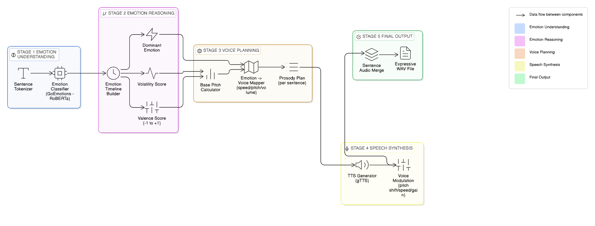

# Empathy AI — Emotional Speech Synthesis Engine

**Empathy AI** bridges text emotion detection to expressive, human-like speech synthesis. It detects 28 fine-grained emotions, maps them to vocal parameters (speed, pitch, volume), and generates natural emotionally-resonant audio via a full-stack web application.

## Core Requirements ✅ All Met

| Feature | Implementation |
|---|---|
| **Text Input** | React/Next.js UI + FastAPI endpoint |
| **Emotion Detection** | 28 emotions (GoEmotions model, not just 3) |
| **Vocal Modulation** | Speed (±5%), pitch (±2 semitones), volume (±1.5 dB) |
| **Emotion Mapping** | EMOTION_VOICE_MAP [emotion][intensity] + corpus-level prosody |
| **Audio Output** | 24000 Hz, 16-bit WAV file |

## Stretch Goals ✨ All Implemented

1. **Granular Emotions**: 28 fine-grained emotions vs. 3-class requirement
2. **Intensity Scaling**: 3-level (low/medium/high) based on confidence thresholds
3. **Full-Stack Web UI**: React + FastAPI with real-time audio player
4. **Advanced Prosody**: Valence-driven pitch bias + volatility-aware modulation (beyond SSML)

---

## Technical Stack

| Component | Technology | Why |
|---|---|---|
| **Emotion Detection** | GoEmotions (HuggingFace) | 28 emotions, local inference, no API keys |
| **TTS** | gTTS (Google) | Free, high-quality, no auth |
| **Audio Processing** | pydub | Frame-rate pitch shift (cross-platform) |
| **Backend** | FastAPI | Async, CORS built-in, easy deploy |
| **Frontend** | React + Next.js | Modern, TypeScript, responsive |

## Architecture: 5-Step Pipeline



### **Step 1: Emotion Detection**
- **Input**: Raw text (e.g., "I'm so excited about this amazing opportunity!")
- **Process**: 
  - NLTK `sent_tokenize()` splits text into sentences
  - Each sentence passed to GoEmotions model (SamLowe/roberta-base-go_emotions)
  - Model returns 28 emotion scores per sentence
  - Top emotion + confidence score extracted
  - Confidence mapped to intensity: high (>0.85), medium (0.60–0.85), low (<0.60)
- **Output**: Timeline with {sentence, emotion, confidence, intensity} per sentence

### **Step 2: Corpus Analysis**
- **Input**: Timeline from Step 1
- **Metrics Computed**:
  - **Dominant Emotion**: Most frequent top emotion across all sentences
  - **Weighted Emotion**: Sum of confidence scores per emotion label (highest wins)
  - **Volatility Score**: Proportion of emotion changes between adjacent sentences (0–1)
    - Example: "I'm happy! But also worried." → 1 change / 1 transition = high volatility
  - **Valence Score**: Weighted average emotional sentiment using EMOTION_VALENCE dictionary
    - Maps each emotion to [-1, 1] (joy=+0.90, sadness=-0.95, neutral=0.0)
    - Mix of positive + negative emotions → mixed valence
- **Output**: Aggregated metrics for global prosody modeling

### **Step 3: Prosody Modeling**
- **Input**: Timeline + corpus metrics (valence, volatility)
- **Process**:
  - **Base Pitch Calculation**: `base_pitch = f(valence_score, volatility_score)`
    - Valence contributes subtle global pitch bias (±0.7 semitones max)
    - Volatility dampens intensity (unstable texts → reduced modulation)
  - **Per-Sentence Mapping**: For each sentence:
    - Look up `EMOTION_VOICE_MAP[emotion][intensity]` → {speed, pitch, volume}
    - Apply base_pitch offset to sentence pitch
    - Result: final {speed, pitch_semitones, volume_db}
  - **Ranges** (naturalistic):
    - Speed: 0.94–1.06x (±6% variation)
    - Pitch: ±2 semitones (gentle musical shifts)
    - Volume: ±1.5 dB (subtle loudness)
- **Output**: Enhanced timeline with voice_params per sentence

### **Step 4: TTS & Voice Modulation**
- **Input**: Timeline with sentences + voice_params
- **TTS Synthesis** (per sentence):
  - Google TTS (gTTS) generates 24000 Hz MP3
  - pydub converts MP3 → WAV (lossless)
- **Voice Modulation** (pydub frame-rate technique):
  - **Speed**: `new_frame_rate = frame_rate × speed_factor`
    - Shifts playback speed without changing pitch
  - **Pitch**: `frequency_ratio = 2^(semitones/12)`, apply via frame rate multiplication + resampling
    - Avoids librosa numba JIT issues on Windows
  - **Volume**: `dB_gain` applied via pydub's `apply_gain()`
  - Applied in sequence: speed → pitch → volume
- **Output**: Modulated WAV per sentence

### **Step 5: Audio Assembly**
- **Input**: All modulated sentence WAVs
- **Process**:
  - Concatenate WAVs in order
  - Insert 300ms silence gaps between sentences (natural pacing)
  - Export final mixed audio (24000 Hz, 16-bit WAV)
  - Clean up temporary files
- **Output**: Final WAV file ready for delivery

## Key Innovation: Corpus-Level Prosody

Beyond SSML: automatic **valence-driven pitch bias** (overall sentiment) + **volatility-aware dampening** (emotional stability) = natural emotional color without manual markup.

## Installation (3 Steps)

```bash
# 1. Backend
cd Backend && python -m venv .venv && .\.venv\Scripts\activate
pip install -r requirements.txt

# 2. Frontend  
cd ../Frontend && npm install

# 3. Run (2 terminals)
# Terminal 1: uvicorn main:app --reload --port 8000
# Terminal 2: npm run dev
# Open: http://localhost:3000
```

## Design Choices

- **GoEmotions (28)** over 3-class: richer expression, single model overhead
- **Per-sentence analysis**: handles mixed emotions, smooth transitions
- **Intensity scaling (3-level)**: mirrors human speech intensity
- **Corpus prosody**: sophisticated global bias + per-sentence modulation
- **pydub pitch**: avoids librosa numba issues on Windows
- **gTTS baseline**: cost-effective expressiveness via modulation

---

## Emotion-to-Voice Mapping Logic

### **Psychology Behind the Mapping**

Each emotion dial one or more vocal dimensions:

| Emotion Group | Speed | Pitch | Volume | Rationale |
|---|---|---|---|---|
| **Positive** (joy, excitement, approval) | ↑ +1–5% | ↑ +1–2 st | ↑ +0.4–1.5 dB | Energy, brightness, dominance |
| **Negative** (sadness, grief, remorse) | ↓ -1–4% | ↓ -1–2 st | ↓ -0.3–1.5 dB | Lethargy, darkness, submission |
| **Anger/Intensity** (anger, annoyance) | ↑ +2–5% | = 0–1 st | ↑ +0.8–1.5 dB | Aggression, tension (pitch stays moderate) |
| **Fear/Anxiety** (fear, nervousness) | ↑ +1–4% | ↑ +1–2 st | = -0.5–0.0 dB | Tension (pitch+speed) but not loud |
| **Cognitive** (confusion, curiosity, surprise) | ≈ ±1–2% | ↑ +0.5–1.5 st | = 0.0 dB | Questioning; mild pitch lift; neutral volume |
| **Neutral** | ≈ baseline | ≈ 0 st | ≈ 0 dB | No modulation |

### **Concrete Examples of EMOTION_VOICE_MAP**

```python
# From config.py: emotion → intensity → voice parameters

JOY (positive, energetic):
  High:   speed=1.05x, pitch=+2st,  volume=+1.5dB  # Very happy! Full energy
  Medium: speed=1.03x, pitch=+1st,  volume=+0.8dB  # Pleased, moderately happy
  Low:    speed=1.01x, pitch=+1st,  volume=+0.4dB  # Slight happiness

SADNESS (negative, lethargic):
  High:   speed=0.96x, pitch=-2st,  volume=-1.2dB  # Deep sorrow; slow, low
  Medium: speed=0.97x, pitch=-1st,  volume=-0.6dB  # Melancholy
  Low:    speed=0.98x, pitch=-1st,  volume=-0.3dB  # Mild sadness

FEAR (high tension, narrow voice):
  High:   speed=1.04x, pitch=+2st,  volume=-0.5dB  # Panicked; fast + high pitch but quiet
  Medium: speed=1.02x, pitch=+1st,  volume=-0.2dB  # Nervous
  Low:    speed=1.00x, pitch=+0st,  volume=+0.0dB  # Slight unease

EXCITEMENT (maximal positive energy):
  High:   speed=1.05x, pitch=+2st,  volume=+1.5dB  # Burst of enthusiasm
  Medium: speed=1.03x, pitch=+1st,  volume=+0.8dB  # Energized
  Low:    speed=1.01x, pitch=+1st,  volume=+0.4dB  # Mild uplift

CONFUSION (questioning tone):
  High:   speed=1.01x, pitch=+0st,  volume=-0.2dB  # Utterly lost; slow, questioning
  Medium: speed=1.00x, pitch=+0st,  volume=+0.0dB  # Unsure
  Low:    speed=0.99x, pitch=+0st,  volume=+0.0dB  # Minor uncertainty
```

### **How Intensity Scaling Works**

Confidence score (0–1) → **Intensity Level** → **Voice Parameter Magnitude**

```
Emotion: JOY with confidence 0.92
  Confidence 0.92 > 0.85 → Intensity: HIGH
  Lookup: JOY[HIGH] = {speed: 1.05, pitch: +2, volume: +1.5}
  Result: "This is amazing!" sounds truly excited

Emotion: JOY with confidence 0.68
  Confidence 0.68 ∈ [0.60, 0.85] → Intensity: MEDIUM
  Lookup: JOY[MEDIUM] = {speed: 1.03, pitch: +1, volume: +0.8}
  Result: "This is good." sounds pleasantly happy (less intense)

Emotion: JOY with confidence 0.45
  Confidence 0.45 < 0.60 → Intensity: LOW
  Lookup: JOY[LOW] = {speed: 1.01, pitch: +1, volume: +0.4}
  Result: "This is fine." sounds mildly satisfied (barely modulated)
```

**Why This Matters**: Strong emotional confidence (0.92) → maximum prosody shift. Borderline detection (0.45) → subtle modulation. Prevents over-expressiveness of uncertain predictions.

### **Corpus-Level Adjustment**

After per-sentence mapping, **corpus metrics** apply global bias:

```
Base Pitch Adjustment = f(valence_score, volatility_score)

Example 1: "I'm happy! Very happy!"
  Valence: +0.90 (very positive)
  Volatility: 0.0 (stable emotion)
  → Base pitch: +0.6 semitones (positive → lift pitch slightly)
  Each sentence's pitch += 0.6 semitones
  Result: Overall "bright" tone throughout

Example 2: "I'm excited! But also nervous."
  Valence: +0.35 (mixed: joy 0.90 + fear -0.20)
  Volatility: 1.0 (100% emotion change → unstable)
  → Base pitch: +0.1 semitones (mixed), × 0.6 damping (volatility)
  → Final adjustment: +0.06 semitones
  Each sentence's pitch += 0.06 semitones (dampened, less jarring)
  Result: Consistent, grounded tone despite emotional swings
```

### **The Three-Level Hierarchy**

1. **Global Level** (corpus):
   - Valence → base pitch bias (±0.7 semitones, subtle)
   - Volatility → modulation damping factor (0.5–1.0×)

2. **Sentence Level** (per-emotion):
   - EMOTION_VOICE_MAP[emotion][intensity]
   - ±5% speed, ±2 semitones pitch, ±1.5 dB volume

3. **Final Level**:
   - sentence_pitch += base_pitch (smooth global + local expression)
   - Result: Natural, emotionally coherent speech

## Project Structure

```
├── Backend/          # FastAPI; POST /generate-speech
├── Frontend/         # React; chat UI + audio player
├── empathy_engine/   # Emotion detection + pipeline
├── README.md         # This file
└── ARCHITECTURE.md   # Full PlantUML diagram
```

## How We Exceed Requirements

| Category | Requirement | Implementation |
|---|---|---|
| **Emotions** | ≥3 | 28 (12 positive, 11 negative, 4 cognitive, 1 neutral) |
| **Parameters** | ≥2 | 3 (speed, pitch, volume) |
| **UI** | CLI/endpoint | Full-stack (React + FastAPI) |
| **Prosody** | Optional SSML | Automatic corpus-level bias |

## Performance

- **First run**: ~10–15s (model loading)
- **Subsequent**: ~4–7s (cached)
- **Latency**: emotion detect (1–2s) + TTS (3–5s) + modulation (1–2s)

## Deploy

```dockerfile
FROM python:3.11-slim
WORKDIR /app
COPY Backend ./Backend
COPY empathy_engine ./empathy_engine
RUN pip install -r Backend/requirements.txt
EXPOSE 8000
CMD ["uvicorn", "Backend.main:app", "--host", "0.0.0.0"]
```

Deploy to: Render, Railway, AWS Lambda, Google Cloud Run (backend); Vercel/Netlify (frontend)

## Testing

```bash
cd empathy_engine && python test_pipeline.py
```

Test cases: positive, negative, mixed, neutral text samples

## Dependencies

**Backend**: fastapi, uvicorn, transformers, torch, gTTS, pydub, numpy, librosa, soundfile, nltk

**Frontend**: react 18+, next 14+, tailwind, typescript

